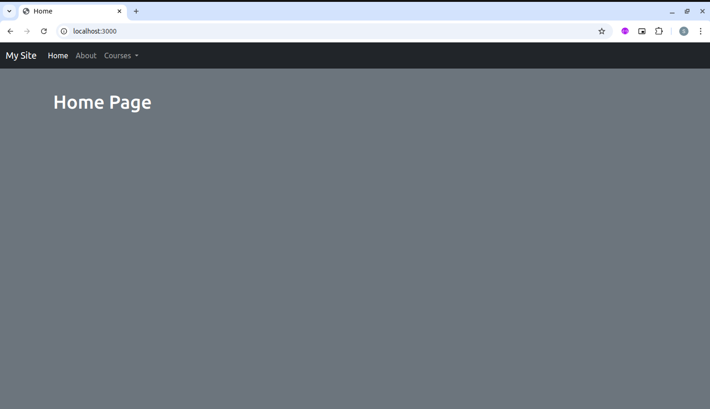
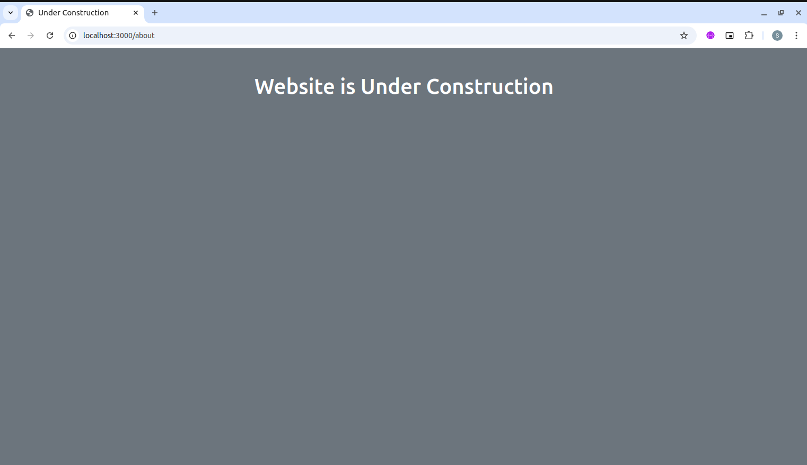

# Underconstruction Page

### Screeshots:

Under Construction Page
This project is a simple "Under Construction" page built with [Node.js](https://nodejs.org/en/download) and [Express](https://expressjs.com/), displaying a friendly message and relevant information for users while a site or feature is being developed. The project uses [EJS](https://www.npmjs.com/package/ejs) for templating to render dynamic HTML, allowing for easy customization of messages, images, and links. [JavaScript](https://developer.mozilla.org/en-US/docs/Web/JavaScript) is used for small interactive elements, such as countdowns or animations, enhancing user engagement. [Nodemon](https://www.npmjs.com/package/nodemon) enables real-time updates during development, making it quick and efficient to deploy changes. This project is ideal for understanding server-side rendering and creating maintenance or placeholder pages.

## ⚙️ Requirements
- [Npm](https://www.npmjs.com/package/download)
- [Express](https://expressjs.com/)
- [Nodejs](https://nodejs.org/en/download)

## 🛠 Languages or Frameworks Used
#### Steps to create a project and install the required module:
#### Step 1: Start the project using the following command in your project folder:

  + `npm init`
  
#### 📥 Step 2: Install the required modules using the following command:

  + `npm install express`
  + `npm install ejs`
  + `npm install nodemon`
  
#### Step 3: Create two folders inside the project directory using the following command:

+ `mkdir model`
+ `mkdir views`
 
#### Step 4: Create another file named app.js inside the project directory:

+ `touch app.js`

#### Step 5: Navigate inside the middleware folder and create a file Uc-middleware.js which will contain our middleware

+ `cd middlewares`
    +  `Uc-middleware.js`

#### Step 6: Navigate inside the views folder and create the following EJS files:

+ `cd views`
    + `touch about.ejs`
    + `touch home.ejs`
    + `touch siteuc.ejs`
+ `cd partial`
    + `touch footer.ejs`
    + `touch header.ejs`
  
#### Step 7: Run the following command to ensure all modules are loaded:

+ `npm install`
  
### 🌟 Steps to run the application -
#### Step 1: Type the following command in the terminal of your project directory:

+ `npm run dev` or 
+ `npm start`